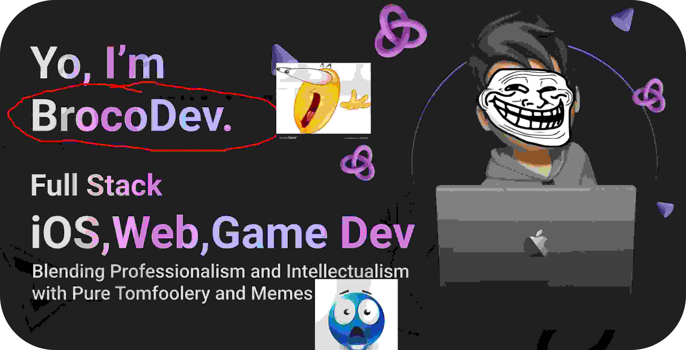

  

  

## what's good! 👋 I'm BrocoDev, a funni lil ios and game developer fr.

🚀 14 Years Old, Canadian & Lebanese, English and Francais.

👨‍🏭 Owner of the Nocturna Development Team, Experienced in Leadership and Management.

🛠️ My code toolkit includes Java, C#, Python, C++, Swift/SwiftUI, JavaScript, Electron, and HTML/CSS.

🌟 Currently Learning Robotics lol

### Creator of: 
- **[Melatonin](https://www.npmjs.com/package/Melatonin)** 
- **[ThirdStore](https://github.com/Broco8Dev/ThirdStore)** 
- **[SwiftUI-Windows](https://github.com/Broco8Dev/SwiftUI-Windows)**

- 🔭 I’m currently working as **Owner of Nocturna Development Team**
- 🌱 I’m currently learning **Backend Development With C++**
- 👯 I’m looking to collaborate on open source/commercial projects
- 💬 Ask me about **Game Development**
- 📫 How to reach me:
  **[Twitter](https://twitter.com/Broco8Real), [Discord](https://discord.com/users/723310347724783687)**

